#  User Manual
## ระบบสมัครสมาชิก เข้าสู่ระบบและลบบัญชีผู้ใช้

---

## 1. หน้าแรกของระบบ

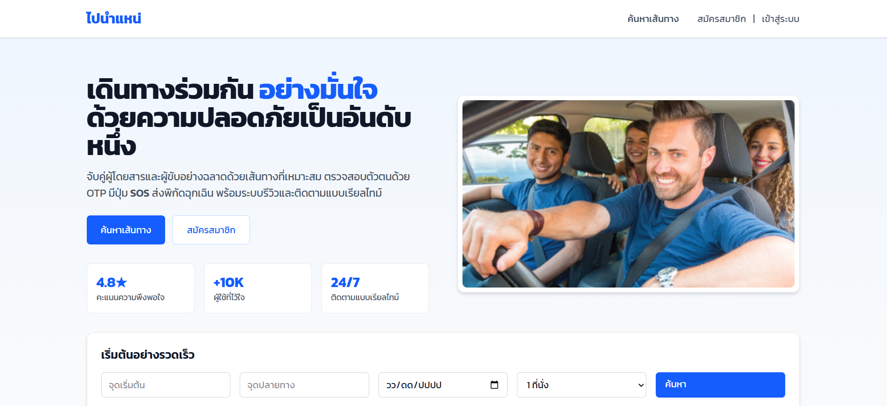

หน้าแรกของระบบจะแสดงเมนูสำหรับผู้ใช้งานใหม่และผู้ใช้งานเดิม  
หากต้องการสร้างบัญชีใหม่ ให้กดปุ่ม **สมัครสมาชิก**

---

## 2. หน้าสมัครสมาชิก (สร้างบัญชีผู้ใช้)

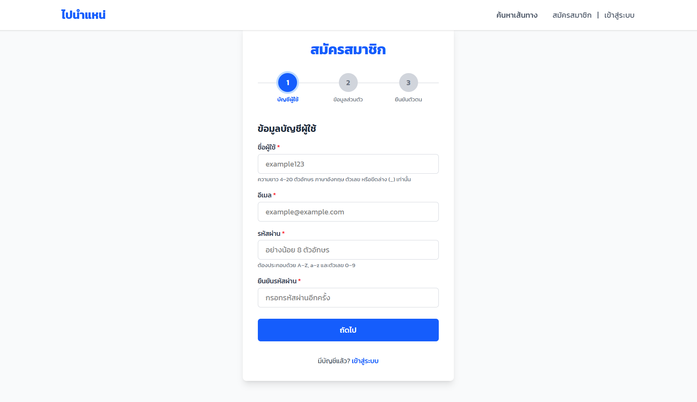

กรอกข้อมูลสำหรับสร้างบัญชี:
- ชื่อผู้ใช้ (Username)
- อีเมล (Email)
- รหัสผ่าน (Password)

เมื่อกรอกครบแล้ว กดปุ่ม **ถัดไป**

---

## 3. กรอกข้อมูลส่วนตัว

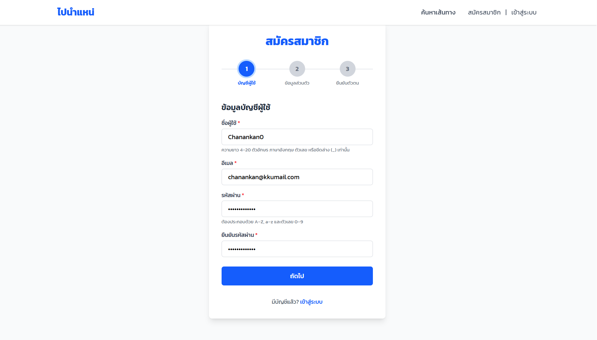

ระบบจะเข้าสู่หน้ากรอกข้อมูลส่วนตัว ได้แก่:
- ชื่อจริง
- นามสกุล
- เบอร์โทรศัพท์
- เพศ

กรอกข้อมูลให้ครบถ้วน แล้วกด **ถัดไป**

---

## 4. หน้ารายละเอียดการสมัครสมาชิก

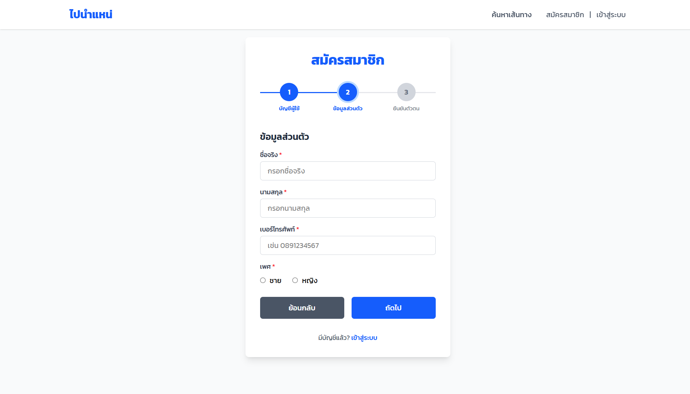

ระบบแสดงหน้าสมัครสมาชิกในส่วนรายละเอียดเพิ่มเติมของผู้ใช้งาน

---

## 5. กรอกข้อมูลรายละเอียดเพิ่มเติม

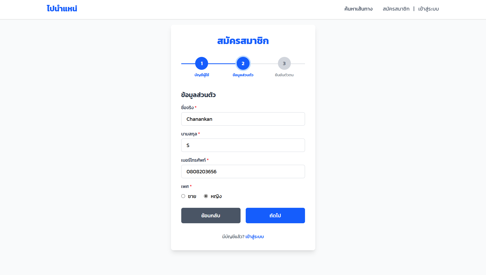

กรอกข้อมูลส่วนตัวเพิ่มเติมให้ครบถ้วน  
จากนั้นกด **ถัดไป**

---

## 6. หน้ายืนยันตัวตน

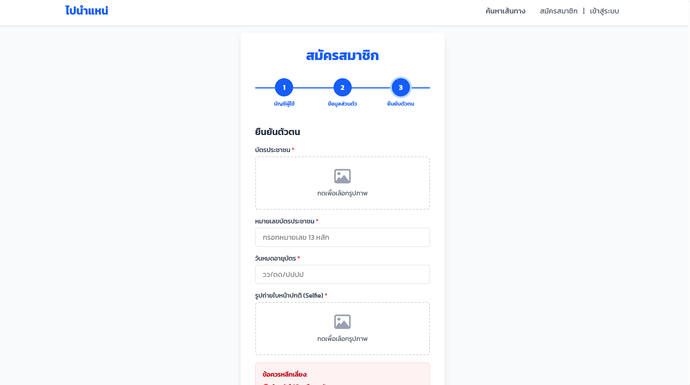

ขั้นตอนการยืนยันตัวตน ผู้ใช้ต้องกรอกข้อมูลดังนี้:
- อัปโหลดรูปบัตรประชาชน
- หมายเลขบัตรประชาชน
- วันหมดอายุบัตร
- รูปถ่ายใบหน้า

จากนั้น:
- ติ๊กยอมรับเงื่อนไข และนโยบายความเป็นส่วนตัว
- กดปุ่ม **สมัครสมาชิก**

---

## 7. สมัครสมาชิกสำเร็จ

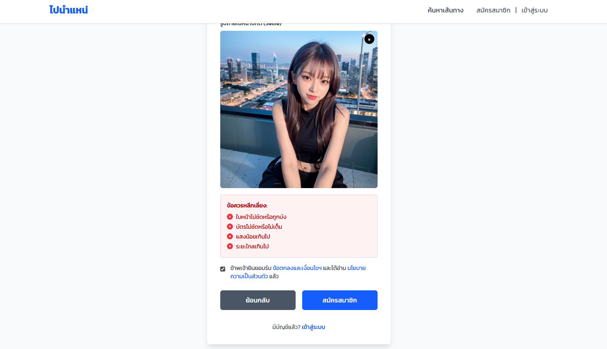

เมื่อกรอกข้อมูลครบถ้วนและกดสมัครสมาชิก  
ระบบจะพาไปยังหน้าสมัครสมาชิกเรียบร้อย

---

## 8. หน้าสมัครสมาชิกเรียบร้อย

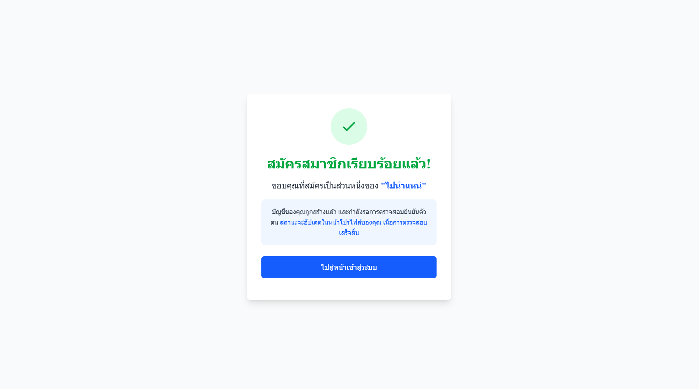

แสดงข้อความว่าสมัครสมาชิกสำเร็จ  
กดปุ่ม **ไปสู่หน้าเข้าสู่ระบบ**

---

## 9. หน้าเข้าสู่ระบบ

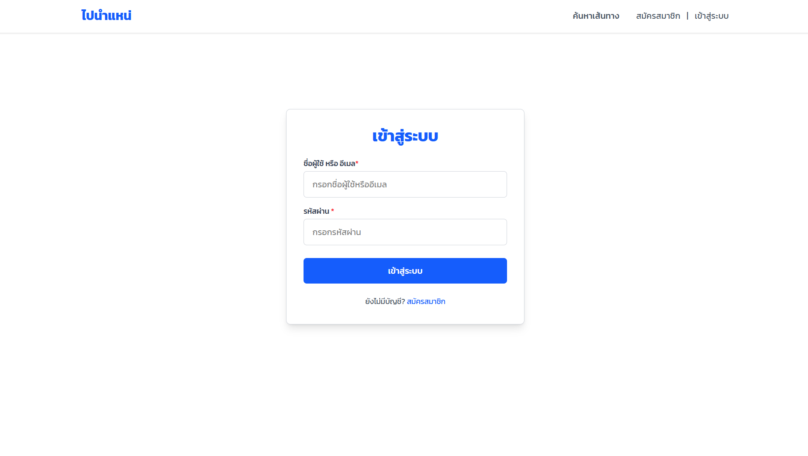

กรอกข้อมูลเข้าสู่ระบบ:
- ชื่อผู้ใช้ หรือ อีเมล
- รหัสผ่าน

จากนั้นกดปุ่ม **เข้าสู่ระบบ**

---

## 10. หน้าหลักหลังเข้าสู่ระบบ

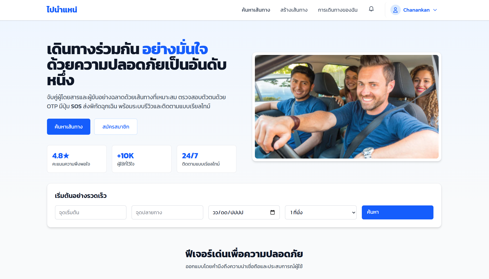

เมื่อเข้าสู่ระบบสำเร็จ ระบบจะแสดงหน้าหลัก  
ให้กดที่ **ชื่อผู้ใช้งาน**

---

## 11. เข้าหน้าบัญชีของฉัน

เลือกเมนู **บัญชีของฉัน**

---

## 12. หน้าโปรไฟล์ และปุ่มลบบัญชี

ระบบจะแสดงข้อมูลโปรไฟล์ของผู้ใช้  
เมื่อเลื่อนลงด้านล่างสุด จะพบปุ่ม **ลบบัญชี**

---

## 13. หน้ากรอกเหตุผลการลบบัญชี

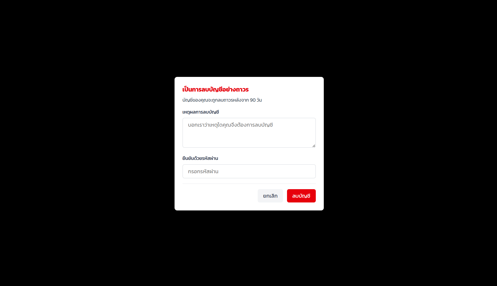

ผู้ใช้ต้อง:
- กรอกเหตุผลที่ต้องการลบบัญชี
- ใส่รหัสผ่านเพื่อยืนยันตัวตน

จากนั้นสามารถ:
- กด **ลบบัญชี** เพื่อยืนยันการลบ
- หรือกด **ยกเลิก** หากไม่ต้องการลบ

---

## 14. แจ้งเตือนลบบัญชีสำเร็จ

เมื่อกดลบบัญชี ระบบจะแสดงข้อความแจ้งเตือนว่า  
**ลบบัญชีเรียบร้อยแล้ว**

---

## 15. กลับสู่หน้าแรก

หลังจากลบบัญชีสำเร็จ  
ระบบจะพาผู้ใช้กลับไปยังหน้าแรกก่อนเข้าสู่ระบบ

---

# หมายเหตุ

- การลบบัญชีเป็นการดำเนินการถาวร
- หลังจากลบบัญชี ผู้ใช้จะไม่สามารถเข้าสู่ระบบได้อีก
- หากต้องการใช้งานใหม่ จะต้องสมัครสมาชิกใหม่อีกครั้ง
