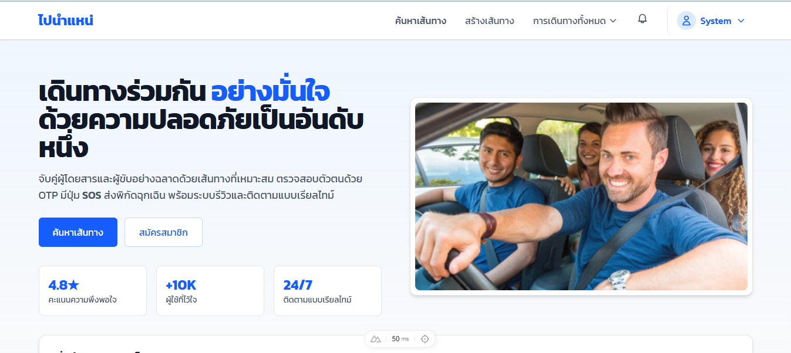
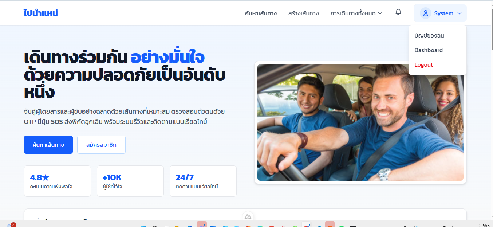
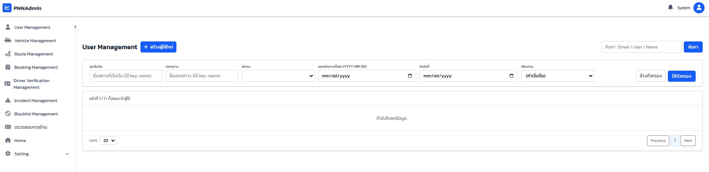
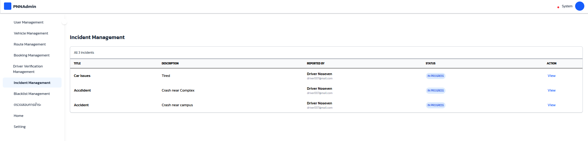
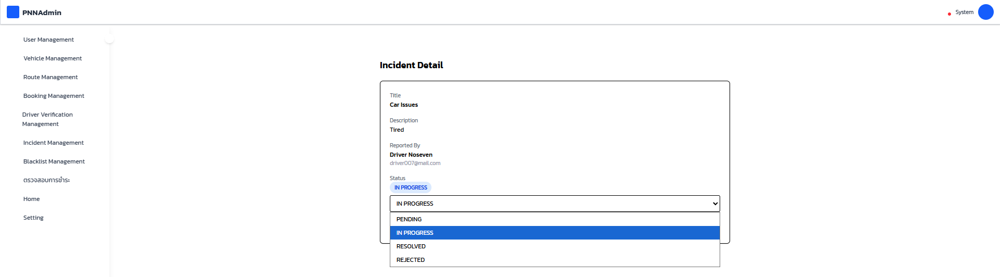

#  User Manual
## ระบบอัปเดตสถานะของรายงาน(Update Incident Report)

---

## หน้าแรกของระบบ (สำหรับผู้ดูแลระบบ)

เมื่อผู้ดูแลระบบ (Admin) เข้าสู่เว็บไซต์  
ระบบจะแสดงหน้าแรกของแพลตฟอร์ม ซึ่งประกอบด้วย:

- เมนูนำทางด้านบน
- ปุ่มค้นหาเส้นทาง
- ปุ่มสร้างเส้นทาง
- ไอคอนแจ้งเตือน (Notification)
- เมนูโปรไฟล์ผู้ใช้งาน (มุมขวาบน)

---

## การเข้าสู่ Dashboard สำหรับ Admin

1. หลังจากเข้าสู่ระบบด้วยบัญชีที่มีสิทธิ์ Admin
2. ให้คลิกที่เมนูโปรไฟล์ด้านขวาบน (ชื่อผู้ใช้งาน เช่น "System")
3. เลือกเมนู **Dashboard** 

ระบบจะพาไปยังหน้า Dashboard สำหรับผู้ดูแลระบบ

---

## หน้า Dashboard ของ Admin

ในหน้า Dashboard ผู้ดูแลระบบสามารถ:

- จัดการผู้ใช้งาน
- ตรวจสอบรายงาน (Reports)
- ตรวจสอบการรายงานเหตุการณ์ (Incident Report)
- ระงับบัญชี (Blacklist)
- รายชื่อผู้ใช้งานที่ถูกระงับบัญชี
- จัดการข้อมูลยานพาหนะของผู้ขับขี่
- จัดการเส้นทางการเดินทาง
- ตรวจสอบและจัดการข้อมูลการจอง
- จัดการการยืนยันตัวตนของผู้ขับขี่
- ตรวจสอบธุรกรรมการชำระเงิน

## การเข้าสู่ หน้า Incident Management สำหรับ Admin

หน้า Incident Management เป็นหน้าสำหรับผู้ดูแลระบบ (Admin)
ใช้ในการตรวจสอบและอัปเดตสถานะรายงานเหตุการณ์ของผู้ใช้งานภายในระบบ

โดยในคอลัมน์ "Action" ผู้ดูแลสามารถ:

- กดปุ่ม "View" เพื่อเข้าสู่หน้าการเปลี่ยนสถานะของรายงาน

ในหน้า Incident Detail ผู้ดูแลระบบสามารถ:

- เลือกเปลี่ยนสถานะของรายงาน (เช่น In Progress)
- กดปุ่ม "Update Status" เพื่อดำเนินการ

หลังจากอัปเดตแล้ว ระบบสามารถ:

- ส่งการแจ้งเตือนให้ผู้ใช้ทราบถึงสถานะรายงานของตนเอง

