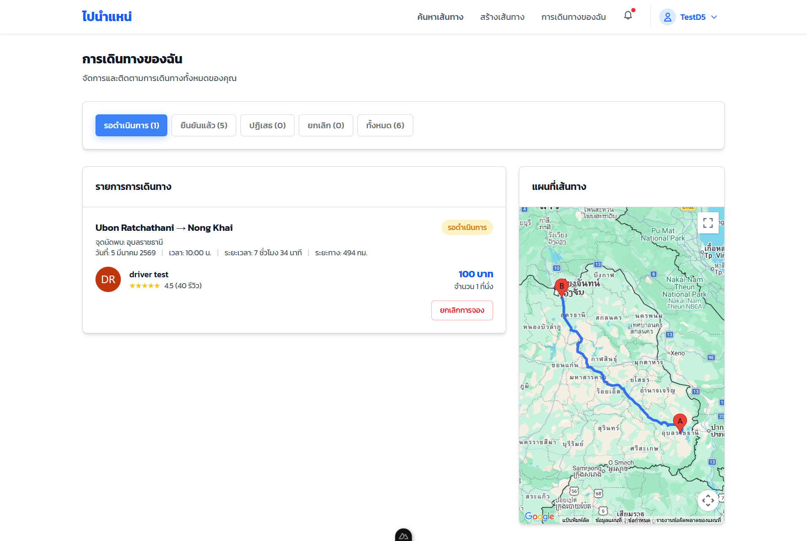
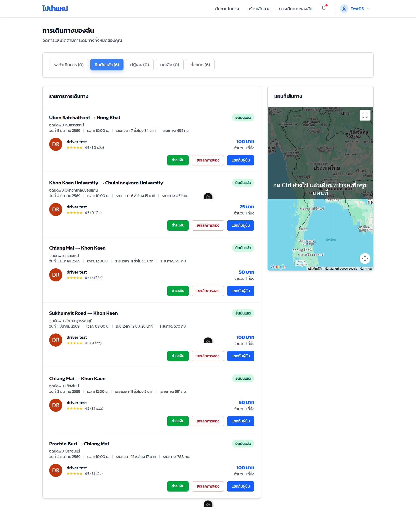
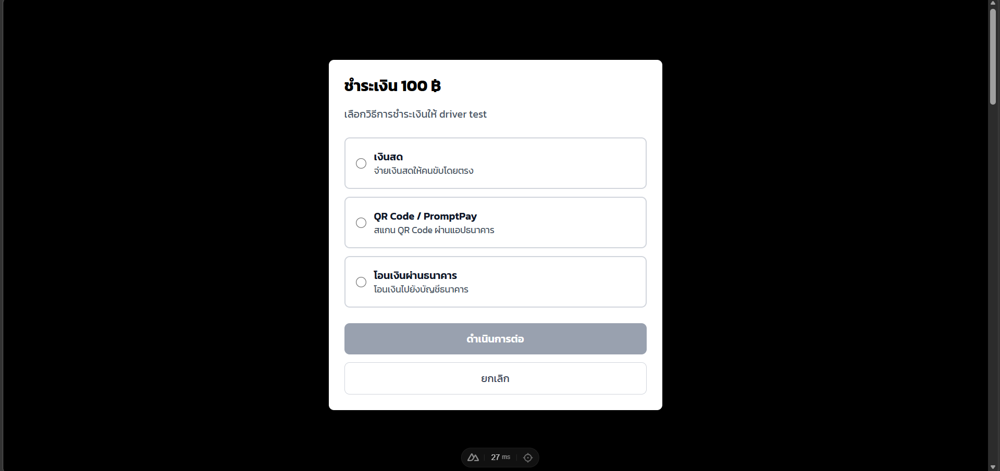
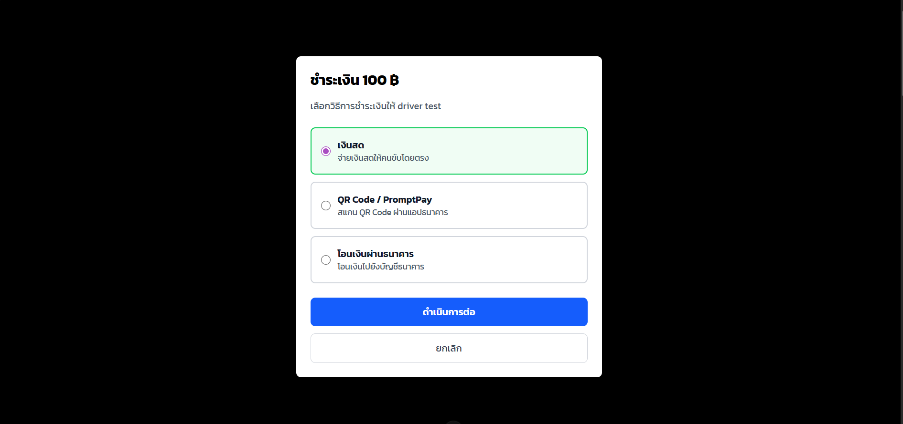
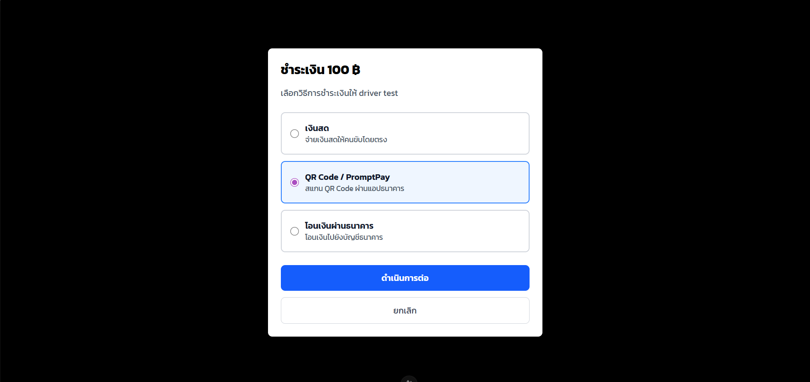
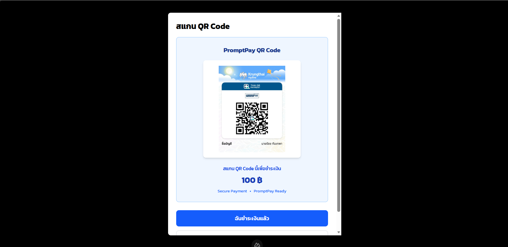
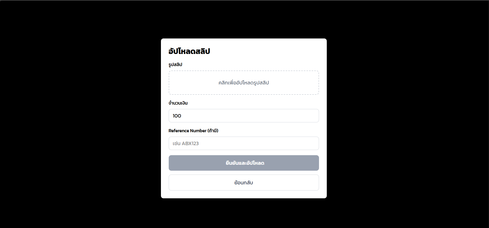
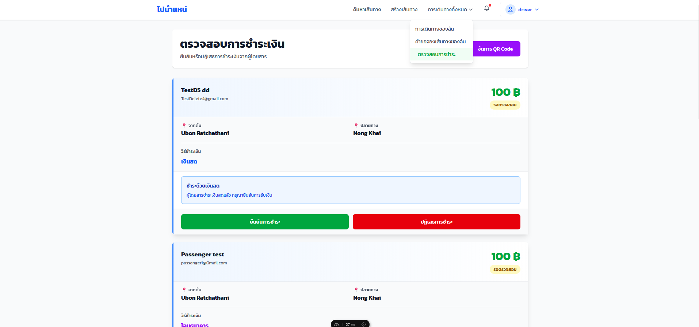

# User Manual
## ระบบการชำระเงิน (Payment System)


---

## 1. ภาพรวมระบบ

ระบบการชำระเงินของ **ไปนำแหน่ (PaiNamNae)** รองรับการชำระเงินค่าเดินทางระหว่างผู้โดยสารและคนขับ โดยมี 3 วิธีการชำระเงิน:

| วิธีการ | รายละเอียด |
|---------|------------|
|  **เงินสด** | จ่ายเงินสดให้คนขับโดยตรง |
|  **QR Code / PromptPay** | สแกน QR Code ผ่านแอปธนาคาร |
|  **โอนเงินผ่านธนาคาร** | โอนเงินไปยังบัญชีธนาคารของคนขับ |

### ขั้นตอนโดยรวม

```
ผู้โดยสารจองเส้นทาง → การจองได้รับการยืนยัน (CONFIRMED)
→ ระบบสร้างรายการชำระเงินอัตโนมัติ
→ ผู้โดยสารเลือกวิธีชำระเงิน
→ อัปโหลดหลักฐาน / ยืนยันการจ่าย
→ คนขับตรวจสอบและยืนยัน
```

---

## 2. สำหรับผู้โดยสาร (Passenger)

### 2.1 การเข้าหน้าชำระเงิน



1. เข้าสู่ระบบด้วยบัญชีผู้โดยสาร
2. ไปที่เมนู **"การเดินทางของฉัน"** หรือเข้าตรงที่ URL: `/payment/passenger`
3. ระบบจะแสดงรายการชำระเงินทั้งหมดของคุณ

### 2.2 ข้อมูลที่แสดงในรายการ



แต่ละรายการชำระเงินจะแสดง:
- **เส้นทาง**: ต้นทาง → ปลายทาง
- **วันที่เดินทาง**
- **ระยะทาง** และ **ระยะเวลา**
- **จำนวนเงิน** (คำนวณจาก จำนวนที่นั่ง × ราคาต่อที่นั่ง)
- **ชื่อคนขับ**
- **สถานะการชำระเงิน** (Badge สถานะ)
- **ขั้นตอนการชำระเงิน** (Timeline แสดง 3 ขั้นตอน)

### 2.3 การชำระเงิน



กดปุ่ม **"ชำระเงิน"** ที่รายการที่มีสถานะ "รอชำระเงิน" จะปรากฏหน้าต่าง (Modal) ให้เลือกวิธีการชำระ:

---

#### วิธีที่ 1: ชำระด้วยเงินสด 



1. เลือก **"เงินสด"** แล้วกดปุ่ม **"ดำเนินการต่อ"**
2. ระบบแสดงจำนวนเงินที่ต้องจ่าย
3. จ่ายเงินสดให้คนขับโดยตรง
4. กดปุ่ม **"ยืนยันจ่ายเงินสดแล้ว"**
5. ระบบจะแจ้งเตือนคนขับให้ยืนยันการรับเงิน
6. รอคนขับกดยืนยัน

> **หมายเหตุ:** สถานะจะเปลี่ยนเป็น "รอยืนยันเงินสด" จนกว่าคนขับจะกดยืนยัน

---

#### วิธีที่ 2: ชำระด้วย QR Code / PromptPay 



> วิธีนี้จะแสดงเฉพาะเมื่อคนขับได้ตั้งค่า QR Code ไว้แล้ว

1. เลือก **"QR Code / PromptPay"** แล้วกดปุ่ม **"ดำเนินการต่อ"**
2. ระบบแสดง QR Code ของคนขับ พร้อมจำนวนเงิน
3. เปิดแอปธนาคารของคุณ สแกน QR Code เพื่อโอนเงิน
4. กดปุ่ม **"ฉันชำระเงินแล้ว"**
5. **อัปโหลดสลิป:**
   - คลิกพื้นที่อัปโหลดเพื่อเลือกรูปสลิป
   - กรอก **จำนวนเงิน** (ระบบจะใส่ค่าเริ่มต้นให้)
   - กรอก **Reference Number** (ถ้ามี)
   - กดปุ่ม **"ยืนยันและอัปโหลด"**
6. ระบบจะอ่านข้อมูลจากสลิปอัตโนมัติ (OCR) และแจ้งเตือนคนขับ

---

#### วิธีที่ 3: โอนเงินผ่านธนาคาร 


> วิธีนี้จะแสดงเฉพาะเมื่อคนขับได้ตั้งค่าข้อมูลบัญชีธนาคารไว้แล้ว

1. เลือก **"โอนเงินผ่านธนาคาร"** แล้วกดปุ่ม **"ดำเนินการต่อ"**
2. ระบบแสดงข้อมูลบัญชีธนาคารของคนขับ:
   - ชื่อธนาคาร
   - เลขบัญชี
   - ชื่อบัญชี
   - จำนวนเงินที่ต้องโอน
3. สามารถกด **"คัดลอก"** เพื่อคัดลอกข้อมูลแต่ละรายการได้
4. ทำการโอนเงินผ่านแอปธนาคาร
5. กดปุ่ม **"ฉันโอนเงินแล้ว"**
6. **อัปโหลดสลิป:** (เหมือนขั้นตอนของ QR Code)
   - เลือกรูปสลิป
   - กรอกจำนวนเงินและ Reference Number
   - กดปุ่ม **"ยืนยันและอัปโหลด"**

---

### 2.4 การดูสลิป



- หากอัปโหลดสลิปแล้ว จะมีปุ่ม **"ดูสลิป"** ให้กดเพื่อเปิดดูรูปสลิปในหน้าต่างใหม่

### 2.5 การส่งสลิปใหม่ (กรณีถูกปฏิเสธ)

- หากคนขับปฏิเสธการชำระเงิน จะมีปุ่ม **"ส่งใหม่"** (สีส้ม) ให้กดเพื่อส่งหลักฐานการชำระอีกครั้ง
- เหตุผลที่ถูกปฏิเสธจะแสดงอยู่ในกรอบข้อความสีแดงใต้รายการ

### 2.6 ข้อมูลจากการอ่านสลิป (OCR)

หลังอัปโหลดสลิป ระบบจะแสดงข้อมูลที่อ่านได้จากสลิป:
- จำนวนเงิน
- Reference Number
- วันที่

> ข้อมูล OCR เป็นเพียงข้อมูลอ้างอิงเพื่อช่วยในการตรวจสอบ

---

## 3. สำหรับคนขับ (Driver)

### 3.1 การเข้าหน้าตรวจสอบการชำระเงิน



1. เข้าสู่ระบบด้วยบัญชีคนขับ
2. ไปที่เมนู **"การเดินทางทั้งหมด"** → **"ตรวจสอบการชำระ"**
   หรือเข้าตรงที่ URL: `/payment/driver`
3. ระบบจะแสดงเฉพาะรายการที่ **รอการตรวจสอบ** (verificationStatus = pending)

### 3.2 การตั้งค่า QR Code และข้อมูลธนาคาร


ก่อนรับชำระเงินผ่าน QR Code หรือโอนธนาคาร คนขับต้องตั้งค่าก่อน:

1. กดปุ่ม **"จัดการ QR Code"** (มุมขวาบนของหน้า)
2. ระบบจะนำไปยังหน้า `/driver/qrCode` เพื่อ:
   - อัปโหลด QR Code ของ PromptPay
   - กรอกข้อมูลบัญชีธนาคาร (ชื่อธนาคาร, เลขบัญชี, ชื่อบัญชี)

### 3.3 ข้อมูลที่แสดงในรายการรอตรวจสอบ

แต่ละรายการแสดง:
- **ชื่อผู้โดยสาร** และ **อีเมล**
- **จำนวนเงิน**
- **เส้นทาง** (ต้นทาง → ปลายทาง)
- **วิธีชำระเงิน** (เงินสด / โอนธนาคาร / QR Code)
- **รูปสลิป** (ถ้ามี) — สามารถกดดูขนาดใหญ่ได้
- **ข้อมูล OCR** (ถ้ามี)

### 3.4 ข้อมูล OCR (การอ่านสลิปอัตโนมัติ)

ระบบจะตรวจสอบสลิปอัตโนมัติและแสดงผลลัพธ์:

| สถานะ | ความหมาย |
|-------|----------|
|  **ตรงกัน** (สีเขียว) | จำนวนเงินในสลิปตรงกับยอดที่ต้องชำระ |
|  **ไม่ตรง** (สีแดง) | จำนวนเงินในสลิป **ไม่ตรง** กับยอดที่ต้องชำระ — ควรตรวจสอบละเอียด |
|  **อ่านไม่ได้** (สีส้ม) | ระบบไม่สามารถอ่านข้อมูลจากสลิปได้ — ต้องตรวจสอบด้วยตาเอง |

### 3.5 รายการตรวจสอบ (Checklist)

เมื่อมีรูปสลิป ระบบจะแสดงรายการตรวจสอบ:
- [ ] ชื่อธนาคารตรงกับ QR Code
- [ ] จำนวนเงินตรงกับการจอง
- [ ] ชื่อบัญชีปลายทาง (PromptPay)
- [ ] วันที่สลิปตรงกับการชำระ

### 3.6 การยืนยัน/ปฏิเสธการชำระเงิน

#### ยืนยันการชำระ 
1. กดปุ่ม **"ยืนยันการชำระ"** (สีเขียว)
2. ระบบแสดง Modal ยืนยัน พร้อมข้อมูลผู้โดยสารและจำนวนเงิน
3. สามารถเพิ่มหมายเหตุได้ (ไม่บังคับ) เช่น "สลิปตรวจสอบเรียบร้อย"
4. กดปุ่ม **"ยืนยัน"**
5. ระบบจะแจ้งเตือนผู้โดยสารว่าการชำระเงินผ่านการตรวจสอบแล้ว

#### ปฏิเสธการชำระ 
1. กดปุ่ม **"ปฏิเสธการชำระ"** (สีแดง)
2. ระบบแสดง Modal ปฏิเสธ
3. ระบุ **เหตุผลการปฏิเสธ** เช่น "จำนวนเงินไม่ถูกต้อง" หรือ "สลิปไม่ชัด"
4. กดปุ่ม **"ปฏิเสธ"**
5. ระบบจะแจ้งเตือนผู้โดยสารพร้อมเหตุผล ให้ส่งหลักฐานใหม่ได้

### 3.7 การยืนยันเงินสด (กรณีผู้โดยสารเลือกจ่ายเงินสด)

เมื่อผู้โดยสารแจ้งจ่ายเงินสด รายการจะปรากฏในหน้าตรวจสอบ:
- ถ้าได้รับเงินจริง → กดปุ่ม **"ยืนยันการชำระ"**
- ถ้ายังไม่ได้รับเงิน → กดปุ่ม **"ปฏิเสธการชำระ"** พร้อมระบุเหตุผล

---

## 4. สถานะการชำระเงิน

### สถานะหลัก (Payment Status)

| สถานะ | Badge | ความหมาย |
|-------|-------|----------|
| `pending` | 🟡 รอชำระเงิน | ผู้โดยสารยังไม่ได้ดำเนินการชำระเงิน |
| `cash_pending` | 🟠 รอยืนยันเงินสด | ผู้โดยสารแจ้งจ่ายเงินสดแล้ว รอคนขับยืนยัน |
| `completed` | 🔵 รอการยืนยัน | อัปโหลดสลิปแล้ว รอคนขับตรวจสอบ |
| `approved` | 🟢 ชำระเรียบร้อย | คนขับยืนยันการชำระเงินแล้ว |
| `rejected` | 🔴 ถูกปฏิเสธ | คนขับปฏิเสธ — ผู้โดยสารสามารถส่งใหม่ได้ |

### Flow การเปลี่ยนสถานะ

```
                          ┌──── [เงินสด] ─────→ cash_pending ──→ approved/rejected
                          │
pending ──→ ชำระเงิน ────┤
                          │
                          └──── [QR/โอน] ─────→ completed ────→ approved/rejected
```

---

## 5. การแจ้งเตือน (Notifications)

ระบบจะส่งการแจ้งเตือนอัตโนมัติ:

| เหตุการณ์ | ผู้รับแจ้งเตือน | ข้อความ |
|-----------|----------------|---------|
| ผู้โดยสารแจ้งจ่ายเงินสด |  คนขับ | "มีการชำระเงินสดรอยืนยัน" |
| ผู้โดยสารอัปโหลดสลิป |  คนขับ | "มีการอัปโหลดสลิปชำระเงิน" |
| คนขับยืนยันเงินสด |  ผู้โดยสาร | "การชำระเงินสดได้รับการยืนยัน" |
| คนขับปฏิเสธเงินสด |  ผู้โดยสาร | "การชำระเงินสดถูกปฏิเสธ" |
| คนขับยืนยันสลิป |  ผู้โดยสาร | "ยืนยันการชำระเงินเรียบร้อย" |
| คนขับปฏิเสธสลิป |  ผู้โดยสาร | "การชำระเงินไม่ผ่านการตรวจสอบ" |


---

## 6. ใบเสร็จรับเงิน (Receipt)

ใบเสร็จรับเงินคือเอกสารหลักฐานที่ระบบออกให้โดยอัตโนมัติเมื่อสถานะการชำระเงินได้รับการยืนยัน "ชำระเรียบร้อย" จากคนขับแล้ว เพื่อใช้เป็นหลักฐานว่าคุณได้ชำระค่าบริการครบถ้วน

### ข้อมูลที่แสดงบนใบเสร็จรับเงิน
*   **ข้อมูลทั่วไป:** หมายเลขใบเสร็จ (RCP-...) และวันที่พิมพ์เอกสาร
*   **ข้อมูลผู้โดยสาร:** ชื่อ-นามสกุล, อีเมล, เบอร์โทรศัพท์ และเลขที่การจอง (Booking ID)
*   **ข้อมูลเส้นทาง:** จุดเริ่มต้น, จุดหมายปลายทาง, ระยะทาง, ระยะเวลา, วันเวลาเดินทาง และราคาต่อที่นั่ง
*   **ข้อมูลคนขับ:** ชื่อคนขับ และทะเบียนรถ
*   **ข้อมูลการชำระเงิน:** ช่องทางการชำระเงิน (เช่น ผ่านธนาคาร, พร้อมเพย์, เงินสด) และวันที่ยืนยันยอด
*   **ยอดรวม:** จำนวนเงินที่ชำระทั้งหมด

### วิธีการเรียกดูและดาวน์โหลด
1.  เข้าสู่ระบบและไปที่หน้า **"รายการชำระเงิน"**
2.  ตรวจสอบรายการที่มีสถานะ **"ชำระเรียบร้อย"** (แถบสีเขียว)
3.  คลิกที่ปุ่ม **"ใบเสร็จรับเงิน"** (ที่มีไอคอนดาวน์โหลด) ด้านล่างของรายการนั้น
4.  ระบบจะเปิดหน้าต่างใหม่และสร้างใบเสร็จรับเงินขึ้นมา คุณสามารถสั่งพิมพ์ผ่าน Browser หรือเลือก **"บันทึกเป็น PDF" (Save as PDF)** บนอุปกรณ์ของคุณได้ทันที

---

## 7. ใบกำกับภาษีอย่างย่อ (Abbreviated Tax Invoice)

ระบบ PaiNamNae รองรับการออก "ใบกำกับภาษีอย่างย่อ" โดยอัตโนมัติสำหรับทุกยอดการชำระเงินที่เสร็จสมบูรณ์ เพื่อแสดงรายละเอียดการแยกภาษีมูลค่าเพิ่ม (VAT 7%) อย่างถูกต้องตามกฎหมาย


### ข้อมูลที่แสดงบนใบกำกับภาษีอย่างย่อ
*   **ข้อมูลผู้ให้บริการ:** ชื่อบริษัท (บริษัท ไพนำแน จำกัด), ที่อยู่, เบอร์โทรศัพท์ และเลขประจำตัวผู้เสียภาษี
*   **ข้อมูลเอกสาร:** วันที่ออกเอกสาร และเลขที่ใบกำกับภาษี (INV-YYYYMMDD-...)
*   **รายการบริการ:** ระบุเส้นทางการเดินทาง (จุดเริ่มต้น ไปยัง จุดหมายปลายทาง) พร้อมจำนวนและราคา
*   **สรุปยอดรวม:** 
    * เงินรวมก่อนภาษี (Base Amount)
    * ภาษีมูลค่าเพิ่ม 7.00%
    * ยอดรวมทั้งสิ้น พร้อมจำนวนเงินสะกดเป็นตัวอักษร
*   **ข้อมูลผู้ซื้อ:** ชื่อผู้โดยสาร และวิธีการชำระเงิน

### วิธีการเรียกดูและดาวน์โหลด
1.  ในหน้า **"รายการชำระเงิน"** เลือกรายการที่สถานะเป็น **"ชำระเรียบร้อย"**
2.  คลิกที่ปุ่ม **"ใบกำกับภาษีแบบย่อ"** (ปุ่มสีน้ำเงินที่มีไอคอนรูปเอกสาร) 
3.  ระบบจะเปิดหน้าต่างใหม่แสดงใบกำกับภาษีอย่างย่อ ซึ่งประกอบด้วยข้อมูลของบริษัท ไพนำแน จำกัด และรายละเอียดการคำนวณภาษี
4.  คุณสามารถสั่งพิมพ์หรือบันทึกเป็นไฟล์ PDF ได้จากคำสั่งพิมพ์ของเบราว์เซอร์ (Print to PDF) โดยตรง

### ข้อควรทราบ
เนื่องจากเป็น **ใบกำกับภาษีอย่างย่อ** ระบบจะดึงชื่อของคุณไปใส่ในช่อง "ผู้ซื้อ" โดยอัตโนมัติ และไม่มีความจำเป็นต้องกรอกเลขประจำตัวผู้เสียภาษีหรือที่อยู่ของผู้โดยสารเพิ่มเติมเพื่อขออกเอกสารฉบับนี้


> 📌 **หมายเหตุ:** User Manual นี้จัดทำตามโค้ดเวอร์ชันปัจจุบัน (มีนาคม 2026) รายละเอียดอาจเปลี่ยนแปลงตามการอัปเดตของระบบ


